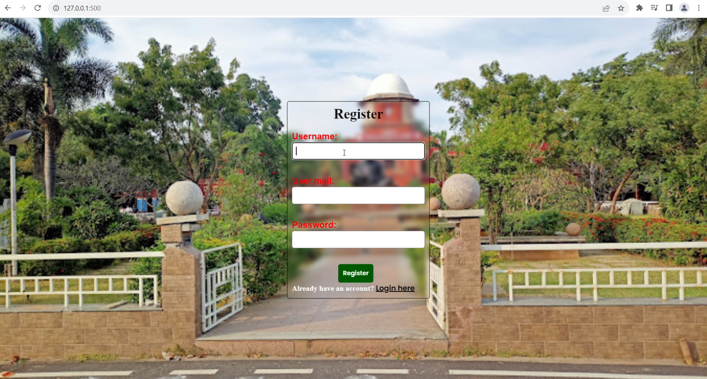
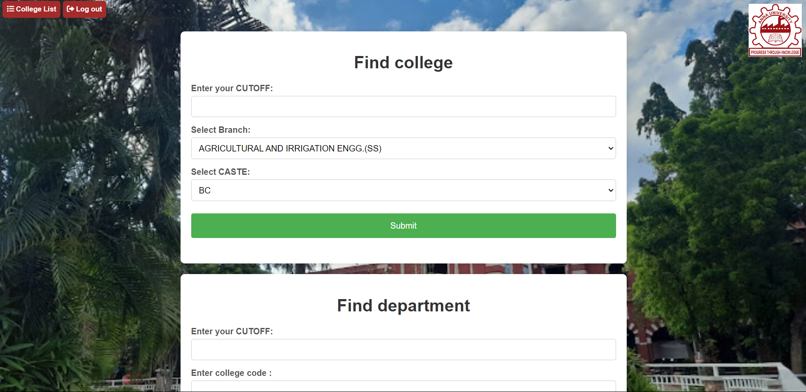
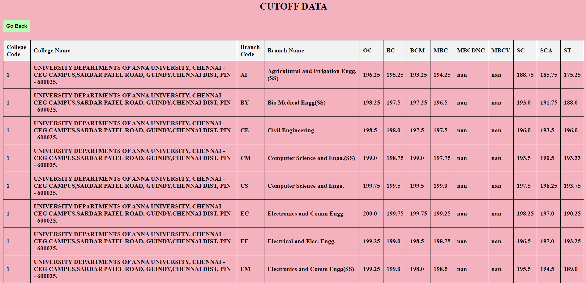

<h1 align="center">College Recommendation System</h1>

> Check out My portfolio: [Portfolio](https://nirmalkumarofllll.github.io/Portfolio/)

## Login

 
The sign-up and login page is designed with a clean and intuitive user interface, ensuring that users can easily navigate and interact with the system. The use of HTML for the frontend allows for a highly customizable and visually appealing design, which can be tailored to meet the specific needs and branding of the project. This enhances user engagement and satisfaction. By leveraging Python for the backend, the project provides real-time sign-in and login features. This ensures that users can instantly access the system without delays, making the process smooth and efficient. Real-time authentication is crucial for maintaining user engagement and providing immediate feedback, which is especially important in applications where timely access is essential. Using Python for backend development allows the implementation of robust security measures to protect user data. Features such as encrypted passwords, secure session management, and validation checks help safeguard sensitive information. Ensuring data integrity and security builds user trust and complies with data protection regulations.

 
The integration of Python for the backend ensures robust and efficient data handling, allowing for real-time sign-in and login features that significantly enhance user convenience. Users can enter their cutoff marks, select their preferred branch, and caste to receive tailored recommendations, streamlining the college search process. This feature is especially beneficial for students navigating complex admission criteria, providing them with personalized and accurate college options based on their academic credentials. The project's frontend, built using HTML, provides a clean and user-friendly interface, making it easy for users to interact with the system. The layout is intuitive, with clearly labeled fields and buttons that guide users through the process of finding suitable colleges and departments. The visual appeal of the interface, combined with its practical functionality, ensures a positive user experience.

 
The college list feature is developed for displaying cutoff data under various categories, such as branch code and caste, offers significant advantages for students navigating the college admission process. This tool provides a comprehensive and organized view of cutoff marks for different colleges and branches, making it easier for students to compare their options based on their academic performance and preferences. By categorizing the data according to branch codes and caste, the system ensures that users can quickly find the most relevant information tailored to their specific needs, enhancing the efficiency and accuracy of their college selection process. The backend development using Python ensures that the data is handled efficiently, allowing for quick retrieval and display of information. This real-time feature is crucial for students who need up-to-date information to make informed decisions. The frontend, created using HTML, offers a clean and user-friendly interface that simplifies interaction. The intuitive layout, with clearly labeled fields and buttons, guides users through the process of finding suitable colleges based on their cutoff marks, branch preferences, and caste category. 

> Learn How to do this project: [Project](https://nirmalkumarofllll.github.io/Portfolio/CRS.html)
